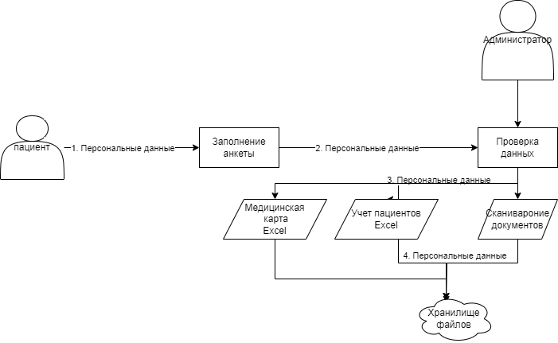
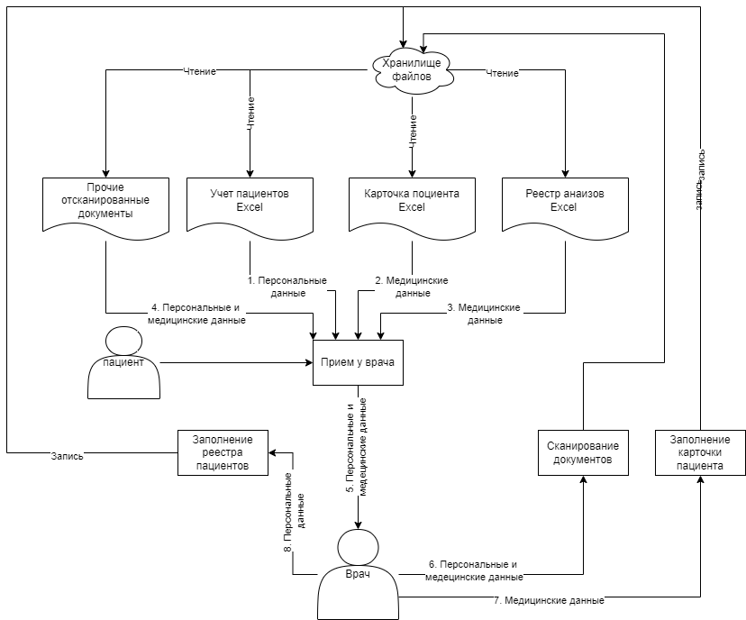
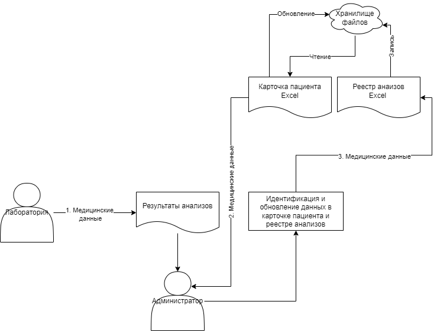
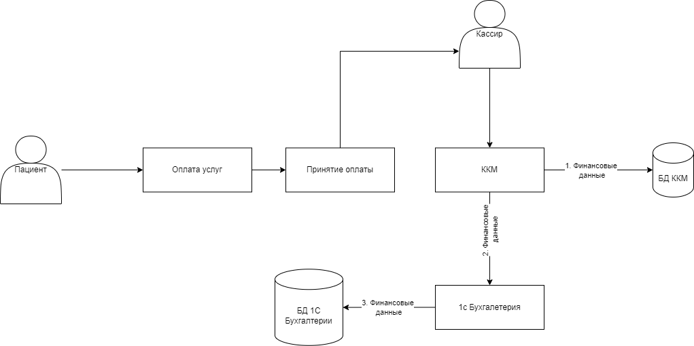
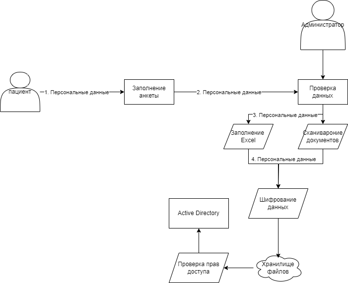
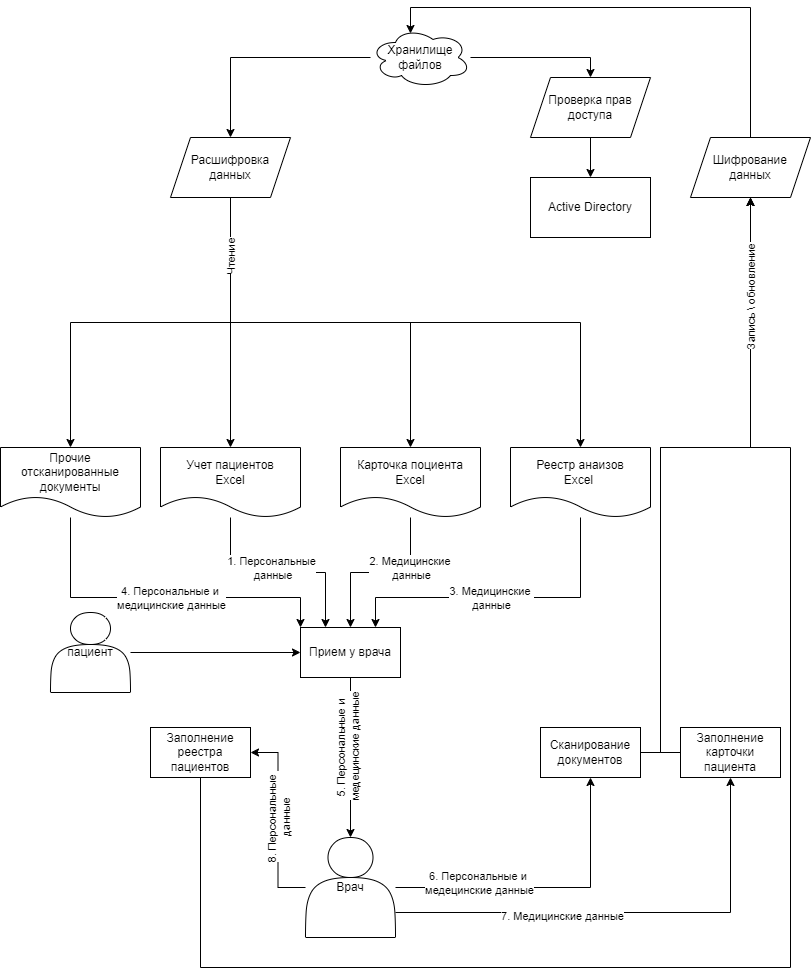
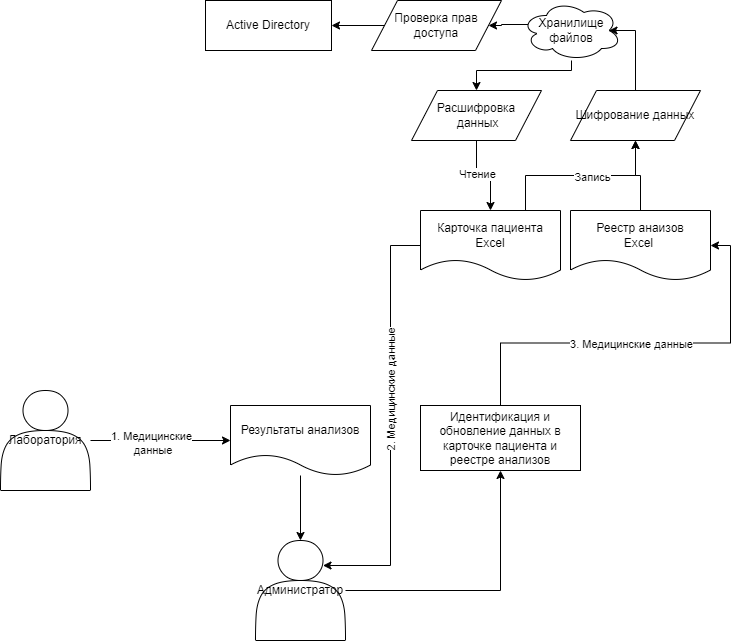
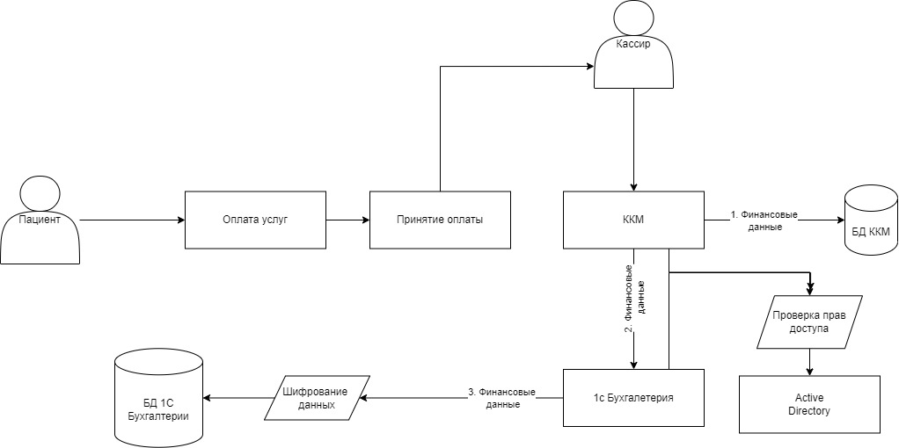

# Потоки данных
[1. Регистрация пациента.drawio](diagrams/1. Регистрация пациента.drawio)

Персональные Данные:
1. ФИО
2. Дата Рождения
3. Телефон
4. Email
5. Адрес прописки*
6. Место работы или учебы*
7. Иное*

Медицинские данные:
1. Хронические заболевания*
2. Иное*

[2. Прием пациента у врача.drawio](diagrams/2. Прием пациента у врача.drawio)

Персональные Данные:
1. ФИО
2. Дата Рождения
3. Телефон
4. Email
5. Адрес прописки*
6. Место работы или учебы*
7. Иное*

Медицинские данные:
1. Данные из карточки пациента
2. Результаты анализов
3. Иное*

[3. Данные анализов.drawio](diagrams/3. Данные анализов.drawio)

Персональные данные:
1. ФИО
2. Номер телефона

Медицинские данные:
1. Результаты анализов

[4. Оплата услуг.drawio](diagrams/4. Оплата услуг.drawio)

Финансовые данные:
1. Данные по транзакции

# Проблемы:

1. Конфиденциальные данные (персональные и медицинские) хранятся в открытом виде на общем диске
2. Отсутствует разграничение прав доступа к конфиденциальным данным
3. Отсутствует аудит доступа к конфиденциальным данным
4. Финансовые данные хранятся в 1с Бухгалтерии в файловом режиме
5. Передача конфиденциальных данных по каналам без шифрования
6. Потенциально, каждый сотрудник компании имеет доступ к файловому хранилищу, и конфиденциальным данным пациентов
7. Отсутствует классификация конфиденциальных данных
8. Не регламентирована работы с конфиденциальными данными, в т.ч. сроки хранения

# Улучшения:

1. Регламентация и разработка документации по работе с конфиденциальными данными
2. Вндренение шифрования, обезличивания и обфускации данных
3. Разграничение прав доступа на основе политик безопасности AD, в перспективе интеграция AD с keycloack для внедрения микросервисной архитектуры
4. Внедрение тегирования данных чувствительных данных
5. Внедрение логирования и аудита логов доступа к конфиденциальным данным
6. Отказ от файлового хранилища БД 1с Предприятие и 1С Торговля и склад в пользу SQL БД

# Тегирование данных
1. PII - персональные данные
2. PHI - медицинские
3. FINU - финансовые данные клиента
4. FINС - финансовые данные компании

[1. Регистрация пациента_tobe.drawio](diagrams/1. Регистрация пациента_tobe.drawio)

[2. Прием пациента у врача.drawio](diagrams/2. Прием пациента у врача.drawio)

[3. Данные анализов_tobe.drawio](diagrams/3. Данные анализов_tobe.drawio)

[4. Оплата услуг_tobe.drawio](diagrams/4. Оплата услуг_tobe.drawio)

